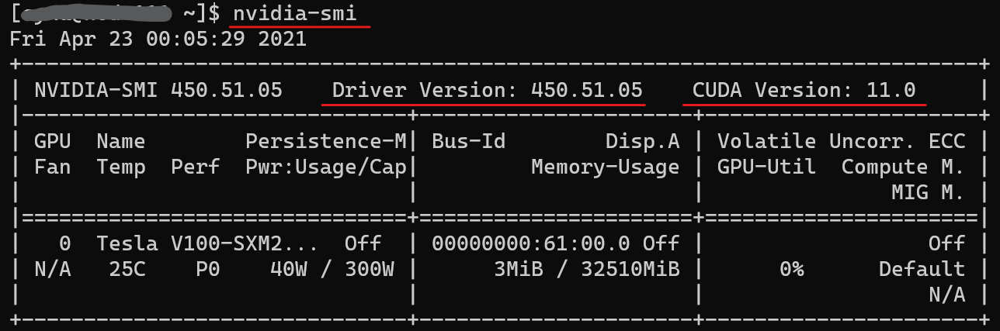

.. _install_label:

============
Installation
============

Virtual environment
===================

The preferred method to install Cosmic-CoNN is to create a new Python virtual environment to avoid dependency issues. We use Anaconda to manage virtual environments and use pip to manage packages:

Anaconda installation documentation: https://docs.anaconda.com/anaconda/install/

Create a new virtual environment in Python version 3.7 named "cosmic-conn"::

    $ conda create --name cosmic-conn python=3.7 -y

Activate this environment::

    $ conda activate cosmic-conn

    if failed, try
    $ source activate cosmic-conn

Install for a CUDA-enabled GPU
==============================

.. Note:: If you are using a Mac or a computer without a dedicated Nvidia GPU, please continue to `Install for CPU`_.

We build Cosmic-CoNN with ``PyTorch``, a machine learning framework that excels with GPU acceleration. In order to detect CRs quickly, it's helpful to determine if your machine has a CUDA-enabled graphics card and configure ``PyTorch`` for GPU before installing Cosmic-CoNN.

A list of CUDA-enabled Nvidia GPUs  
https://developer.nvidia.com/cuda-gpus

NVIDIA CUDA Installation Guide for Linux  
https://docs.nvidia.com/cuda/cuda-installation-guide-linux/index.html

There are many resources online to help you configure the right Nvidia driver and CUDA library. A simple way to verify the correct setup is with the command::

    $ nvidia-smi

If you see a similar output, congratulations! You are very close to enjoy GPU acceleration. Now please visit ``PyTorch`` installation guide to generate the correct installation command based on your environment: https://pytorch.org/get-started/locally/. Select one of the CUDA versions for the ``Compute Platform`` condition. 

To verify PyTorch is correctly configured for GPU, you should see:

.. code-block:: python

    import torch
    
    torch.cuda.is_available()
    >>> True

Continue with `Install for CPU`_ to finish the installation. Since you have ``PyTorch`` configured for GPU already, it will be ignored in the next section.

Install for CPU
===============

.. Note:: Detection time varies based on data and hardware. Although it is easy to achieve ~10x speed up with GPU acceleration, processing time on CPU is not slow. A regular laptop with AMD Ryzen 5900HS CPU takes only ~7s to process a 2009x2009 px image from LCO's 2-meter telescope.

**Test users**, because we have not released the package to Pypi, please install the testing Wheel package below:

Install with `pip`::
    
    # basic install for CR detection or library integration
    $ pip install cosmic-conn

    # include Flask for the web app interface
    $ pip install cosmic-conn[webapp] 

    # install all dependencies for development
    $ pip install cosmic-conn[develop] 

.. $ pip install -i https://test.pypi.org/simple/ cosmic-conn

Or install from the source (repo is still private, please use the method above)::

    $ git clone https://github.com/cy-xu/cosmic_conn
    $ cd cosmic_conn
    $ pip install .

If you are actively developing the package, this allows you to see changes of the code without having to re-install every time::
    
    $ pip install -e .

Alternatively, if you prefer to install in your current Python environment, you could force `pip` to ignore dependencies so it does not upgrade other packages. You will need to manually install the missing packages::

    $ pip install --no-deps .

Test installation
=================

Please refer to the :ref:`user-guide-label` to test the installation. 

Questions
=========

Ask a question in our Github repo's Discussion section:
https://github.com/cy-xu/cosmic_cnnn/discussions