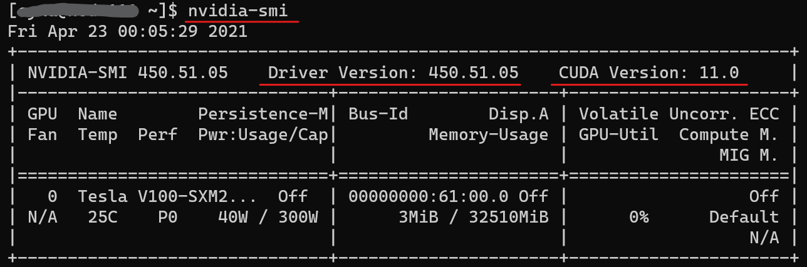

.. _install_label:

============
Installation
============

Virtual environment
===================

The preferred method to install Cosmic-CoNN is to create a new Python virtual environment to avoid dependency issues. We recommend `uv <https://github.com/astral-sh/uv>`_ for managing environments and packages:

uv installation documentation: https://docs.astral.sh/uv/getting-started/installation/

Create and activate a new virtual environment with ``uv``::

    $ uv venv cosmic-conn --python 3.11
    $ source cosmic-conn/bin/activate

Alternatively, you can use Anaconda to manage virtual environments:

Anaconda installation documentation: https://docs.anaconda.com/anaconda/install/

Create a new virtual environment in Python version 3.11 or later named "cosmic-conn"::

    $ conda create --name cosmic-conn python=3.11 -y

Activate this environment::

    $ conda activate cosmic-conn

    if failed, try
    $ source activate cosmic-conn

Install for a CUDA-enabled GPU
==============================

.. Note:: If you are using a Mac or a computer without a dedicated Nvidia GPU, please continue to `Install for CPU`_.

We build Cosmic-CoNN with ``PyTorch``, a machine learning framework that excels with GPU acceleration. In order to detect CRs quickly, it's helpful to determine if your machine has a CUDA-enabled graphics card and configure ``PyTorch`` for GPU before installing Cosmic-CoNN.

A list of CUDA-enabled Nvidia GPUs
https://developer.nvidia.com/cuda-gpus

NVIDIA CUDA Installation Guide for Linux
https://docs.nvidia.com/cuda/cuda-installation-guide-linux/index.html

There are many resources online to help you configure the right Nvidia driver and CUDA library. A simple way to verify the correct setup is with the command::

    $ nvidia-smi

If you see a similar output, congratulations! You are very close to enjoy GPU acceleration. Now please visit ``PyTorch`` installation guide to generate the correct installation command based on your environment: https://pytorch.org/get-started/locally/. Select one of the CUDA versions for the ``Compute Platform`` condition.

To verify PyTorch is correctly configured for GPU, you should see:

.. code-block:: python

    import torch

    torch.cuda.is_available()
    >>> True

Continue with `Install for CPU`_ to finish the installation. Since you have ``PyTorch`` configured for GPU already, it will be ignored in the next section.

Install for CPU
===============

.. Note:: Detection time varies based on data and hardware. Although it is easy to achieve ~10x speed up with GPU acceleration, processing time on CPU is not slow. A regular laptop with AMD Ryzen 5900HS CPU takes only ~7s to process a 2009x2009 px image from LCO's 2-meter telescope.

Install with ``uv`` (recommended). The ``cpu`` and ``cuda`` extras are mutually exclusive and select the appropriate PyTorch build automatically:

.. code-block:: bash

    # CPU-only PyTorch (no GPU required)
    $ uv pip install "cosmic-conn[cpu]"

    # CUDA-enabled PyTorch (requires NVIDIA GPU with CUDA 12.4)
    $ uv pip install "cosmic-conn[cuda]"

    # include Flask for the web app interface
    $ uv pip install "cosmic-conn[cpu,webapp]"

    # install all dependencies for development
    $ uv pip install "cosmic-conn[cpu,develop]"

If you prefer plain ``pip``, install PyTorch separately from the `PyTorch website <https://pytorch.org/get-started/locally/>`_ first, then::

    # basic install for CR detection or library integration
    $ pip install cosmic-conn

    # include Flask for the web app interface
    $ pip install cosmic-conn[webapp]

    # install all dependencies for development
    $ pip install cosmic-conn[develop]

Or install from source::

    $ git clone https://github.com/cy-xu/cosmic_conn
    $ cd cosmic_conn
    $ pip install .

If you are actively developing the package, this allows you to see changes of the code without having to re-install every time::

    $ pip install -e .

Test installation
=================

Please refer to the :ref:`user-guide-label` to test the installation.

Questions
=========

Ask a question in our Github repo's Discussion section:
https://github.com/cy-xu/cosmic_cnnn/discussions
